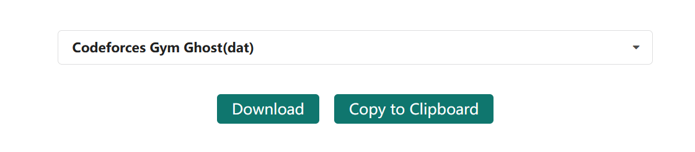
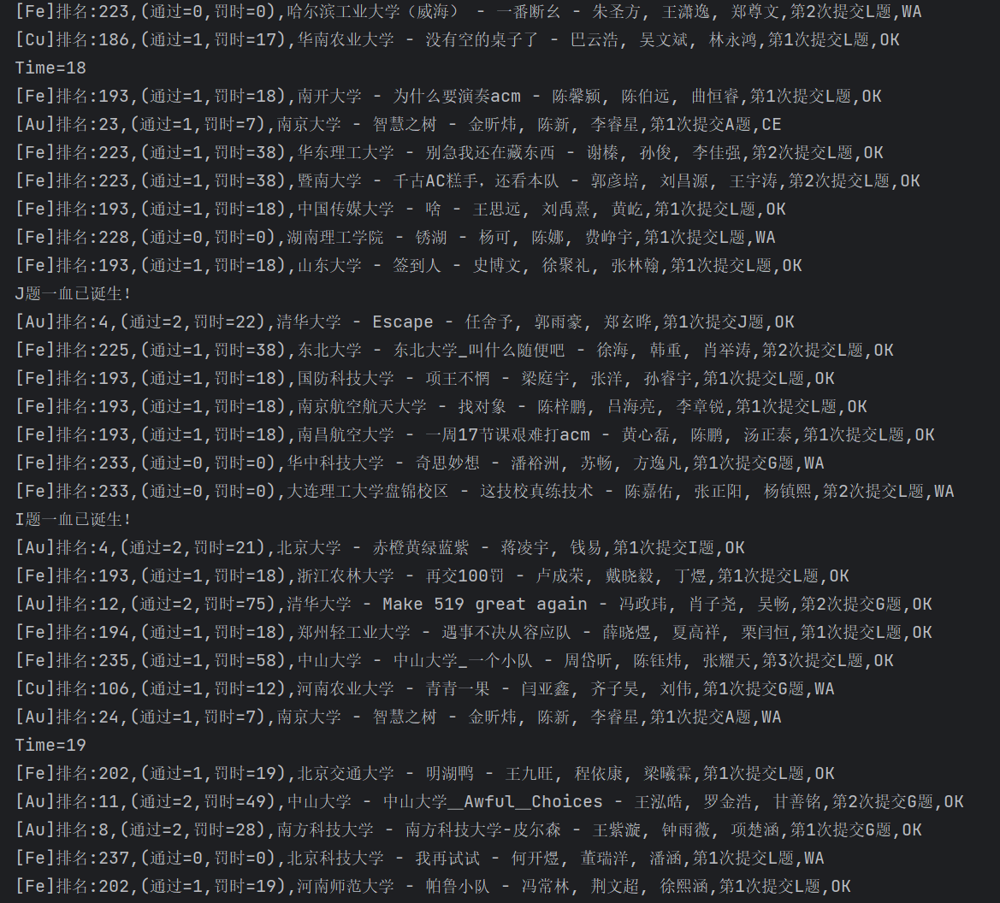

### XCPC queue simulation

~~低技术力(py小白练习编程写的大模拟)，快逃！~~

~~要坐牢五个小时，快逃！~~

运行 run.py ，该代码可以模拟XCPC比赛时直播里的提交队列，包括封榜等功能。

嗯，就是这样。**这意味着你需要浪费五小时看这玩意。** 大概......挺适合打发时间的()

~~当然，你可以将代码里面的sleep参数调小...~~

data.dat 为 2024 ICPC 成都站。这个文件可以替换为任意一场比赛，做法是在 <a href="https://board.xcpcio.com/">XCPCIO</a> 网站下载对应比赛的 dat 文件然后覆盖掉项目里的 data.dat 文件即可。

代码运行效果如下图：

##### upd：更新了 fun mode ，规则和 ICPC 赛制不一样，fun mode 参考了 cf 的积分赛制，每题计分规则如下：

假设某队伍在 $t$ 时刻（分钟）通过某题，且之前不算编译错误的错误提交次数为 $x$ ，那么本题得分为 $\max(600-t-10x^2,200)$

作用的话大概是新增了一些观赏性？？？

~~当然，你也可以自由修改你想要看的奇奇怪怪的赛制~~
