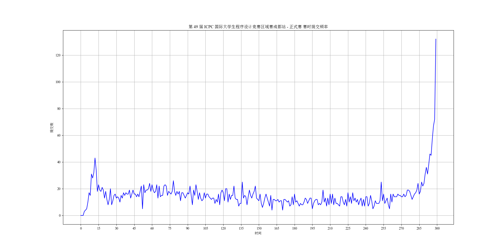

# XCPC queue simulation

~~低技术力(py小白练习编程写的大模拟)，快逃！~~

~~要坐牢五个小时，快逃！~~

~~隔三差五修复一些小bug~~

运行 run.py ，该代码可以模拟 XCPC 比赛时直播里的提交队列，包括封榜等功能。

嗯，就是这样。**这意味着你需要浪费五小时看这玩意。** 大概......挺适合打发时间的()

~~当然，你可以将代码里面的sleep参数调小...~~

项目中的 data.dat 为 2024 ICPC 成都站。这个文件可以替换为任意一场比赛，做法是在 <a href="https://board.xcpcio.com/">XCPCIO</a> 网站下载对应比赛的 dat 文件然后覆盖掉项目里的 data.dat 文件即可。

代码运行效果如下图：

**注意：受赛站奖牌分配具体规则可能略有不同（奖牌线的设置、是否考虑有效队伍等）和打星队伍参与统计的影响，该项目中奖牌分配相关的部分只能作为一个粗略的模拟。**

### upd 1：更新了 fun mode，规则和 ICPC 赛制不一样，fun mode 参考了 cf 的积分赛制，每题计分规则如下：

假设某队伍在 $t$ 时刻（分钟）通过某题，且之前不算编译错误的错误提交次数为 $x$ ，那么本题得分为 $\max(600-t-10x^2,200)$。该计分方式的出发点是侧重考察队伍代码的一次 AC 率。

作用的话大概是新增了一些观赏性？？？

~~当然，你也可以自由修改你想要看的奇奇怪怪的赛制~~

### upd 2：更新了statistics.py，现在可以可视化查看赛时每分钟的提交频率和有效AC提交数。

效果如下图所示：

